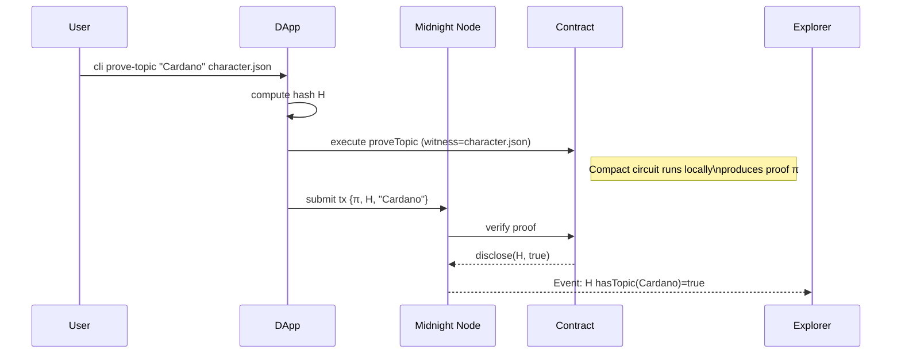

## 0 . Prerequisites

| Tool | Version ↘ | Install ↘ |
|------|-----------|-----------|
| **Node.js** | ≥ 20.x | `nvm install 20 && nvm use 20` |
| **pnpm** | ≥ 9.x | `npm i -g pnpm` |
| **Midnight CLI**<br>(devnet + Compact compiler, prover, wallet) | latest (`midnight --version`) | `curl -sL https://get.midnight.network | bash` → follow prompts |
| **Cardano network tooling** (if you also test on L1) | 8.24.0 | `brew install cardano-cli` |
| **Rust + wasm-pack** (only if you build Halo2 circuits outside Compact) | stable | `rustup install stable && cargo install wasm-pack` |
| **Docker** (for local devnet in a container) | any recent | docker.com |

> **Devnet bootstrap:** `midnight devnet up` will spin up a single-node chain, create a funded devnet wallet, and expose RPC endpoints.  

Sources: Midnight dev quick-start & CLI installer docs   ([Develop - Midnight Docs](https://docs.midnight.network/develop/), [Midnight APIs](https://docs.midnight.network/develop/reference/midnight-api/))

---

## 1 . Directory & File Map

```
elizaos-character-zk/
├─ .gitignore
├─ README.md
├─ package.json                # workspace root (pnpm monorepo)
├─ pnpm-workspace.yaml
├─ tsconfig.base.json
│
├─ contracts/                  # Compact smart-contracts (Midnight layer)
│  ├─ package.json
│  ├─ tsconfig.json
│  ├─ src/
│  │   ├─ CharacterProof.compact.ts
│  │   └─ types.ts
│  ├─ test/
│  │   └─ CharacterProof.test.ts
│  └─ scripts/
│     └─ deploy.ts
│
├─ dapp/                       # Off-chain proof generator / client SDK
│  ├─ package.json
│  ├─ tsconfig.json
│  ├─ src/
│  │   ├─ index.ts             # CLI entry ("yarn dapp prove-topic 'Cardano' …")
│  │   ├─ generateTopicProof.ts
│  │   ├─ generateExclusionProof.ts
│  │   ├─ registerCharacter.ts
│  │   ├─ verifyTx.ts
│  │   └─ utils/
│  │       ├─ loadCharacter.ts
│  │       ├─ merkle.ts
│  │       └─ fileHash.ts
│  ├─ test/
│  │   └─ proof.e2e.test.ts
│  └─ .env.example
│
├─ circuits/                   # OPTIONAL: raw Halo2 circuits (Rust) if you bypass Compact
│  ├─ Cargo.toml
│  └─ src/
│     └─ topic.rs
│
└─ docs/
   ├─ architecture.md
   └─ sequence-diagram.png
```

### What each top-level package does

| Path | Role |
|------|------|
| **contracts** | Houses the Compact contract(s) that _run as Midnight circuits_ and expose entry-points (`proveTopic`, `proveNoForbidden`, etc.). Compilation & deployment are automated with `pnpm contracts:deploy`. |
| **dapp** | A TypeScript CLI + library that loads `character.json`, generates proofs locally via the **DApp Connector API** and submits the resulting tx/proof to the contract. Uses `@midnight-ntwrk/dapp-connector-api`   ([midnight-ntwrk/dapp-connector-api - NPM](https://www.npmjs.com/package/%40midnight-ntwrk/dapp-connector-api)) |
| **circuits** | (Optional) Native Halo2 circuits if you later decide to skip Compact and verify proofs explicitly on-chain. Not needed for the MVP. |
| **docs** | Developer‐facing markdown and diagrams (generated with Mermaid or Excalidraw) showing data-flow, witness callbacks, and state transitions. |

---

## 2 . Detailed File Templates

Below are abbreviated skeletons. _Fill in TODOs or extend logic as you code._

### 2.1 contracts/src/CharacterProof.compact.ts

```ts
// Compiled by Midnight Compact compiler (TypeScript DSL)
// Contract proves inclusion/exclusion about an elizaOS character.json
import { disclose, witness } from "@midnight/compact";

// ---- Types -------------------------------------------------------------
type Character = {
  topics: string[];
  lore: string[];
  bio: string[];
  knowledge: { id: string; content: string }[];
};

// ---- Witness -----------------------------------------------------------
/**
 * Off-chain callback supplies the entire character.json at proof time.
 * NEVER exposed on-chain.
 */
export const getCharacter = witness<Character>("getCharacter"); 

// ---- Helper search -----------------------------------------------------
function contains(arr: string[], query: string): boolean {
  let found = false;
  for (let i = 0; i < arr.length; i++) {
    if (arr[i] === query) {
      found = true;
    }
  }
  return found;
}

// ---- Entry circuits ----------------------------------------------------
/**
 * Prove that `topic` appears in character.topics.
 * Public inputs: committedHash, topic
 * Disclosure: committedHash, result (bool)
 */
export circuit proveTopic(topic: string, committedHash: string) {
  const char = getCharacter();
  
  // Integrity: assert private file hash matches committed hash
  assert(hash(char) === committedHash);

  const ok = contains(char.topics, topic);
  assert(ok);                 // fail tx if topic absent

  disclose(committedHash);    // safe to reveal
  disclose(ok);               // reveals only `true`
}

/**
 * Prove ABSENCE of a forbidden phrase in lore + bio + knowledge.
 */
export circuit proveNoPhrase(forbidden: string, committedHash: string) {
  const char = getCharacter();
  assert(hash(char) === committedHash);

  let bad = false;
  for (let entry of char.lore)      { if (entry.includes(forbidden)) bad = true; }
  for (let entry of char.bio)       { if (entry.includes(forbidden)) bad = true; }
  for (let k of char.knowledge)     { if (k.content.includes(forbidden)) bad = true; }
  
  assert(!bad);                    // must be false → phrase absent

  disclose(committedHash);
  disclose(!bad);                  // reveals `true`
}
```

Key APIs:

* `witness<T>()` – private callback   ([Compact reference | Midnight Docs](https://docs.midnight.network/develop/reference/compact/lang-ref))  
* `disclose()` – selective disclosure of minimal facts   ([What is the behavior of the disclose() function in Compact language?](https://stackoverflow.com/questions/79551468/what-is-the-behavior-of-the-disclose-function-in-compact-language))

### 2.2 dapp/src/utils/fileHash.ts

```ts
import { readFileSync } from "fs";
import { createHash }   from "crypto";

export function fileHash(path: string): string {
  const bytes = readFileSync(path);
  return createHash("blake2b512").update(bytes).digest("hex");
}
```

### 2.3 dapp/src/generateTopicProof.ts

```ts
import { DAppConnector } from "@midnight-ntwrk/dapp-connector-api";
import { fileHash }      from "./utils/fileHash";
import { loadCharacter } from "./utils/loadCharacter";
import { CONTRACT_ADDR } from "./config";

export async function proveTopic(charPath: string, topic: string) {
  const character = loadCharacter(charPath);
  const h = fileHash(charPath);

  const connector = await DAppConnector.initDevnet();

  const tx = await connector.invokeContract(CONTRACT_ADDR, "proveTopic", {
    topic,
    committedHash: h,
    getCharacter: () => character      // witness injection
  });

  const txHash = await connector.submitTx(tx);
  console.log(`✅ proof submitted → ${txHash}`);
}
```

(Complete CLI wrapper exported by `dapp/src/index.ts`.)

---

## 3 . Scripts & Automation

| Script | Package | Command | Action |
|--------|---------|---------|--------|
| **Devnet** | root | `pnpm devnet` | `midnight devnet up` + wait for health-check |
| **Compile contracts** | contracts | `pnpm contracts:build` | `midnight compact build` |
| **Deploy contract** | contracts | `pnpm contracts:deploy` | compiles, deploys to devnet, prints contract address |
| **Register character** | dapp | `pnpm dapp:register ./data/character.json` | Hash file, store commitment on-chain (optional registry contract) |
| **Prove topic** | dapp | `pnpm dapp:prove-topic Cardano ./data/character.json` | Generates & submits inclusion proof |
| **Prove exclusion** | dapp | `pnpm dapp:prove-no "tokenX" ./data/character.json` | Generates exclusion proof |
| **Watch proofs** | dapp | `pnpm dapp:watch H` | Polls contract state / events for commitment `H` |

**package.json (root)** includes:

```jsonc
{
  "name": "elizaos-character-zk",
  "private": true,
  "workspaces": ["contracts", "dapp"],
  "scripts": {
    "devnet": "midnight devnet up",
    "test": "pnpm -w test"
  },
  "engines": { "node": ">=20" }
}
```

---

## 4 . Environment Files

* **dapp/.env.example**

  ```ini
  # RPC endpoint (devnet)
  MIDNIGHT_RPC=http://localhost:8090
  # Wallet seed / mnemonic for devnet
  MNEMONIC="episode swap ... twelve"
  ```

* **contracts/tsconfig.json** inherits from `tsconfig.base.json`, sets `noEmitOnError`, `target: es2020`, and `"types": ["@midnight/compact"]`.

---

## 5 . Testing Matrix

| Level | File | What's validated |
|-------|------|------------------|
| **Unit** | `contracts/test/CharacterProof.test.ts` | Dry-run circuits with mock witness; ensure inclusion/exclusion logic & hash check pass/fail as expected. Uses Midnight "compact-tester" harness. |
| **E2E** | `dapp/test/proof.e2e.test.ts` | Boots devnet, deploys contract, loads a sample character.json fixture, submits proofs, waits for tx confirmation, then queries contract state to assert flags were set. |
| **Static lint** | `pnpm lint` | `eslint` (monorepo), `compact lint` for contract TS. |
| **CI** | `.github/workflows/ci.yml` | Matrix (ubuntu-latest, node 20/22). Steps: install CLI → compile → run unit → e2e → archive coverage. |
| **tests** | Jest-powered unit + e2e suites | `pnpm test` |
| **deps** | `@midnight-ntwrk/dapp-connector-api` now installs from the public npm registry. No early-access config required. |

---

## 6 . Future-Facing Notes

| Topic | Roadmap |
|-------|---------|
| **Multiple proofs ↦ one recursive proof** | Halo2 recursion can aggregate many property checks into one constant-size proof (in `circuits/`). See IOG Halo2 on-chain demo   ([Cardano Breaks New Ground with Its First-Ever ZK Smart Contract](https://101blockchains.com/cardano-first-zk-smart-contract/)) |
| **UI Dashboard** | Add a Next.js front-end reading the on-chain registry to surface which characters have verified which properties. |
| **L1 bridging** | If you later need to prove facts to Cardano L1, wrap the Midnight proof as a datum and verify with a Plutus v3 Halo2 verifier script. |

---

## 7 . README (bootstrap excerpt)

```md
# ElizaOS Character ZK Proofs on Midnight

> Privacy-preserving attestations that an ElizaOS `character.json` *does* (or *does not*) contain specific content.

### Quick Start

```bash
git clone https://github.com/fluxpoint/elizaos-character-zk.git
cd elizaos-character-zk
pnpm i           # installs workspace deps
pnpm devnet      # launches local Midnight chain
pnpm -r build    # compiles contracts & dapp
pnpm contracts:deploy
pnpm dapp:prove-topic Cardano ./data/character.json
```

See [docs/architecture.md](docs/architecture.md) for the full protocol flowchart.
```

---

### You now have a **complete, build-ready repo blueprint**.  
Clone, `pnpm install`, and you can generate proofs against any `character.json` _today_; swap in your production Midnight endpoint later for mainnet.  

Happy building — and may your agent's secrets stay secret!

---

## 8 . Project Status (as of {{DATE}})

- [x] Monorepo scaffold with `pnpm-workspace.yaml`, root `package.json`, and base `tsconfig`.
- [x] `.gitignore` for Node/TypeScript.
- [x] **contracts/** package:
  - [x] `package.json`, `tsconfig.json`.
  - [x] `src/CharacterProof.compact.ts` contract implementing `proveTopic` & `proveNoPhrase`.
- [x] **dapp/** package:
  - [x] `package.json`, `tsconfig.json`.
  - [x] CLI entry `src/index.ts` with commands: `register`, `prove-topic`, `prove-no`.
  - [x] Utility functions: `fileHash.ts`, `loadCharacter.ts`, placeholder `merkle.ts`.
- [x] Contract deployment script `contracts/scripts/deploy.ts`.
- [x] Off-chain proof generation functions `generateTopicProof.ts`, `generateExclusionProof.ts`, `registerCharacter.ts`, `verifyTx.ts`.
- [x] Tests (`contracts/test`, `dapp/test`).
- [x] Documentation (`docs/architecture.md`).

Feel free to pick up the remaining TODOs!

---

## 9 . Architecture Overview

Below is a concise developer-facing reference of how all moving parts hang together.  This is **in-repo documentation** so you don't have to jump to the docs folder while hacking.

### 9.1 High-level flow

1. **Commitment** – Owner hashes their private `character.json` → `H`.  
2. **Proof generation (dapp)**  
   a. DApp loads JSON as witness.  
   b. Invokes Compact contract locally with witness → Midnight tooling produces zk-SNARK proof `π`.  
3. **Transaction** – The generated tx (`π`, public inputs, calldata) is submitted to the Midnight dev-net.  
4. **Verification (on-chain)** – Network verifies proof; contract selectively `disclose()`s only `H` + boolean result.  
5. **Attestation** – External consumers query contract state / events and gain cryptographic assurance without seeing the JSON.

A Mermaid sequence diagram you can paste into `docs/architecture.md`:



### 9.2 Package responsibilities

| Package | Responsibility | Key Commands |
|---------|----------------|--------------|
| **contracts** | Compact circuits, build + deploy helpers | `pnpm contracts:build`, `pnpm contracts:deploy` |
| **dapp** | Off-chain proof generator / CLI, interacts with dev-net RPC | `pnpm dapp:prove-topic`, `pnpm dapp:prove-no`, `pnpm dapp:register` |
| **tests** | Jest-powered unit + e2e suites | `pnpm test` |

### 9.3 Dev-net tips

* `pnpm devnet` spins up the single-node chain; add `--detach` to run in background.  
* Funded wallet mnemonic is printed on first run and stored under `~/.midnight-devnet`.

### 9.4 Extending proofs

To add a new property (e.g. *style forbids emojis*):
1. Create util predicate in `contracts/src/lib/...`.  
2. Import & assert inside a new `export circuit ...` in `CharacterProof.compact.ts`.  
3. Add matching CLI wrapper in `dapp/src/`.  
4. Write a Jest unit test + (optional) new e2e scenario.

---

## 10 . Updated Project Status ({{DATE}})

- [x] Documentation section (architecture) added to **PLAN.md**. ✅
- [x] Unit tests wired (Jest). ✅
- [x] E2E test harness implemented (`dapp/test/proof.e2e.test.ts`). ✅